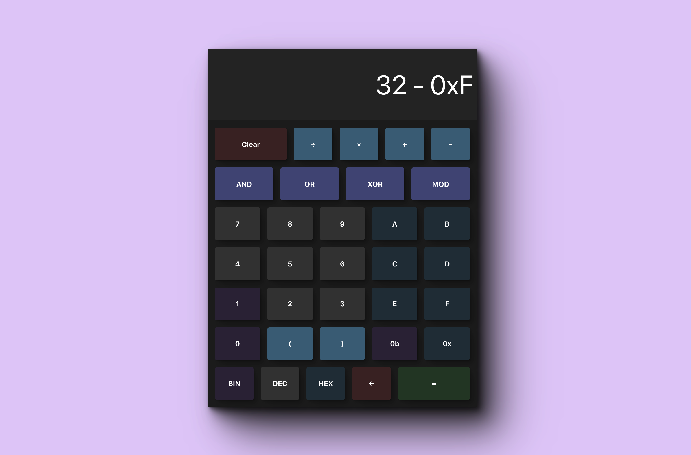

# HarmoniCalc Web

This is the web version of my mixed-base calculator app.

I built this mostly as a baseline for the Swift and Kotlin versions to allow me to have something to work with as I learn those languages. 

Built this in a day. Not sure what bugs there are. Let me know in an issue or on twitter if you encounter a problem.

**Built with ❤️ by [@KyleWestCS](https://twitter.com/KyleWestCS)**